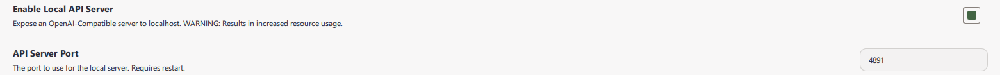
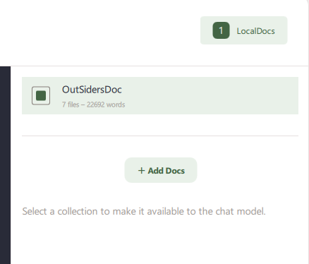
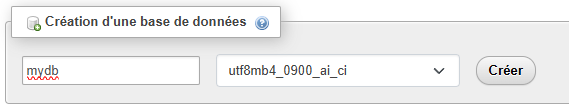

# READ ME : MANUEL D'INSTALLATION
Bonjour et bienvenue dans le manuel d'installation de l'application OutSidersGPT !
Pour faire fonctionner l'application sur votre ordinateur, veuillez s'il vous plaît suivre les étapes suivantes.

## Configuration minimale
La configuration minimale conseillée est :
 - Processeur 12th Gen i7
 - 64 Go de RAM
 - Carte graphique 4 GB

L'application a été développée et testée sur un environnement Windows 11, système d'exploitation 64 bits.

## Installation de GPT4All
Version utilisée lors du développement et des tests :
**GPT4All v3.10.0**

Accédez au site internet de Nomic pour installer GPT4All
[Lien installation GPT4All](https://www.nomic.ai/gpt4all)
Une fois arrivé sur le site, téléchargez l'application pour Windows.
Le fichier a pour nom **gpt4all-installer-win64.exe**

Exécutez le .exe, suivez les étapes en cliquant sur suivant et en acceptant la license puis enfin installez l'application.

Vous pouvez ensuite démarrer l'application pour procéder au paramétrage.

### Paramètres de GPT4All
Au premier démarrage de l'application, GPT4All vous demandera si vous souhaitez fournir des informations anonymes pour leurs analyses internes.
Sélectionnez No aux deux questions.

Allez dans **Models**, cliquez sur le bouton + Add Model et installez **Llama 3.2 1B Instruct**

Dans les **Settings** de l'application, veuillez rendre disponible l'API (Enable Local API Server) et vérifier que le port (API Server Port) est bien **4891**.

Ensuite allez dans **LocalDocs**, cliquez sur le bouton + Add Doc Collection, nommez le OutSidersDoc et sélectionnez le chemin des fichiers de référence.
**Attention** : les documents doivent être stockés en local sur votre ordinateur.
Cliquez sur create collection.

L'étape suivante est à faire **à chaque redémarrage de l'application GPT4All**
Rendez-vous dans la partie **Chats**, et sélectionnez Server Chat.
En haut à droite, cliquez sur le bouton LocalDocs, puis sélectionnez la collection OurSidersDoc.

Parfait, maintenant GPT4All est prêt.

Pensez que à chaque utilisation de l'application, GPT4All doit être lancé.

## Installation de WAMP

Accédez au site sourceForge pour télécharger la version **3.3.0** de WampServer.
[Lien installation WampServer](https://sourceforge.net/projects/wampserver/files/WampServer%203/WampServer%203.0.0/wampserver3.3.0_x86.exe/download)
Le fichier a pour nom **wamperserver3.3.0_89.exe**

Exécutez le .exe, suivez les étapes en cliquant sur Suivant et acceptez la licence.
Lancez ensuite le serveur WampServer. Une popup devrait apparaître et indiquera quand le serveur sera lancé.
Dans le menu Démarrer, une icône de W en vert devrait être apparue.

## Installation de la base de données
Cliquez sur l'icone W verte et cliquez sur **PHPMyAdmin**, cela devrait ouvrir une page web, si cela ne s'ouvre pas, allez sur ce [lien](http://localhost/phpmyadmin/)
Le nom d'utilisateur est root et il n'y a pas de mot de passe.
Cliquez sur **Nouvelle base de données**, donnez-lui le nom de **mydb** et mettez l'interclassement **utf8_general_ci**.

Allez ensuite sur l'onglet importer.

Sélectionnez le ficher du GitHub qui est sous doc et qui s'appelle **DB.sql** puis cliquez sur importer.

Vérifiez que toutes les requêtes ont été faites. Si c'est le cas, la base de données à été créée correctement.

## Installation de l'application
Téléchargez le dossier OutSidersGPT depuis GitHub.

Copiez dans C:\wamp\www sur votre ordinateur.

Vous pouvez ensuite à l'application via ce [lien](http://localhost/OutsidersGPT/public/index.html) sur Edge ou Chrome
Pour y accéder facilement, créez un raccourci ou ajoutez-le en favorit.

